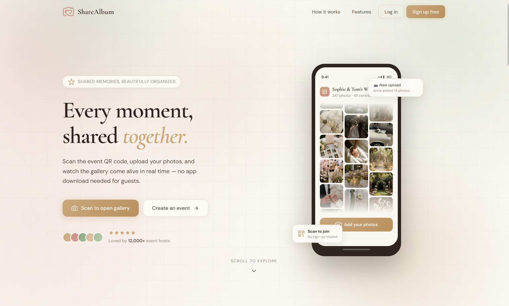

<div align="center">

# ShareAlbum

### Digital Album Sharing Platform for Events

[](https://reactjs.org/)
[](https://vitejs.dev/)
[](https://supabase.com/)
[](https://netlify.com/)

> A platform to create dedicated digital albums for ceremonies and events, with a unique QR code guests scan to view and contribute photos & videos.

**Live:** [sharealbum.ir](https://sharealbum.ir)



</div>

---

## 📋 Table of Contents

- [About](#-about)
- [Tech Stack](#-tech-stack)
- [Folder Structure](#-folder-structure)
- [User Flow](#-user-flow)
- [Features](#-features)
- [Local Development](#-local-development)

---

## 🎯 About

ShareAlbum is an interactive web platform that lets users:

- 📁 Create a **dedicated digital album** for each ceremony or event
- 📲 Let guests join via a **unique QR code**
- 🔐 Keep content secure with **email-verified authentication**
- 🖼️ Upload and view photos & videos in a **shared gallery**
- 📦 **Bulk-download** media from an event
- 👤 Manage personal content and account through a **profile page**

---

## 🛠 Tech Stack

| Layer              | Technology                | Description                                                          |
| ------------------ | ------------------------- | -------------------------------------------------------------------- |
| **Frontend**       | React 19 + Vite           | SPA built with React Hooks, fast dev/build tooling                   |
| **Routing**        | React Router 7            | Client-side routing, protected routes                                |
| **Styling**        | Tailwind CSS              | Custom ivory/gold/sage/blush glassmorphism design system             |
| **Animation**      | motion (Motion for React) | Page transitions and micro-interactions                              |
| **Notifications**  | react-toastify            | Centralized toast feedback across the app                            |
| **Backend**        | Supabase                  | Auth, Database, Storage & Edge Functions — no dedicated server       |
| **Database**       | PostgreSQL (via Supabase) | Stores users, ceremonies, and media metadata                         |
| **Storage**        | Supabase Storage          | Stores uploaded photos and videos                                    |
| **Auth**           | Supabase Auth             | Email/password sign-up & login with email verification, JWT sessions |
| **Edge Functions** | Supabase Edge Functions   | Server-side logic (e.g. account deletion)                            |
| **QR Code**        | qrcode.react              | Generates a unique QR code per ceremony                              |
| **Downloads**      | JSZip                     | Bundles event media into a zip for download                          |
| **Deployment**     | Netlify                   | Auto-deploy from GitHub, free SSL                                    |

---

## 📁 Folder Structure

```
sharealbum/
├── public/
│   ├── favicon.svg
│   ├── icons.svg
│   └── _redirects
└── src/
    ├── App.jsx
    ├── main.jsx
    ├── supabaseClient.js
    ├── assets/
    ├── components/
    │   ├── animate-ui/
    │   │   └── components/backgrounds/bubble.jsx
    │   ├── common/
    │   │   ├── Loader.jsx
    │   │   ├── ProfileMenu.jsx
    │   │   └── ProtectedRoute.jsx
    │   ├── landing/
    │   │   ├── AuthSection.jsx
    │   │   ├── BubbleBackground.jsx
    │   │   ├── CTABanner.jsx
    │   │   ├── Eventtypesmarquee.jsx
    │   │   ├── Features.jsx
    │   │   ├── Footer.jsx
    │   │   ├── Hero.jsx
    │   │   ├── HowItWorks.jsx
    │   │   ├── LandingPageShared.jsx
    │   │   ├── NavBar.jsx
    │   │   ├── PhoneMockup.jsx
    │   │   ├── PhotoMarquee.jsx
    │   │   ├── Seperator.jsx
    │   │   └── WordRotate.jsx
    │   └── ui/
    │       ├── button.jsx
    │       ├── marquee.jsx
    │       ├── shine-border.jsx
    │       └── word-rotate.jsx
    ├── context/
    │   └── AuthContext.jsx
    ├── lib/
    │   ├── toast.jsx
    │   └── utils.js
    └── pages/
        ├── CreateEvent.jsx
        ├── Dashboard.jsx
        ├── FeaturesDocs.jsx
        ├── Gallery.jsx
        ├── LandingPage.jsx
        ├── Login.jsx
        ├── MyEvent.jsx
        ├── MyMedia.jsx
        ├── NotFound.jsx
        ├── Profile.jsx
        ├── ResetPassword.jsx
        ├── Signup.jsx
        └── Upload.jsx
```

---

## 🔄 User Flow

1. **Sign Up** → confirm via **email verification** → **Login**
2. **Create Event** (`/create-event`) → a unique **QR code** is generated for the ceremony
3. Owner shares the QR code → guest scans it → opens the ceremony page (`/ceremony/:id`)
4. Guest or owner **uploads** photos/videos → saved to Supabase Storage → shown live in the **Gallery**
5. Owner manages events from the **Dashboard**, individual events via **MyEvent**, and their own uploads via **MyMedia**
6. Media can be **bulk-downloaded** as a zip
7. Account & profile settings, including **account deletion** (via a Supabase Edge Function), are managed from **Profile**

---

## ✨ Features

- ⚡ **SPA** — instant navigation with React Router, no full-page reloads
- 🔒 **Secure** — email-verified auth; only authenticated users can upload content
- 🍞 **Consistent feedback** — every action surfaces via toast notifications
- 🗑️ **Safe destructive actions** — confirm-to-delete flows (type-to-confirm + progress + success states) for account deletion
- 🎨 **Custom design system** — glassmorphism UI with a consistent ivory/gold/sage/blush palette across every page
- 📱 **Responsive** — works on mobile and desktop
- 📦 **Bulk export** — download all media from an event as a zip
- 🚀 **Extensible** — ready for likes, comments, and social sharing

---

## 🚀 Local Development

The app is live at [sharealbum.ir](https://sharealbum.ir) (deployed on Netlify, auto-deploying from GitHub). These steps are only needed to run the project locally.

**1. Clone & install**

```bash
git clone https://github.com/username/sharealbum.git
cd sharealbum
npm install
```

**2. Set up environment variables**

Create a `.env` file in the project root:

```env
VITE_SUPABASE_URL=your_supabase_url
VITE_SUPABASE_ANON_KEY=your_anon_key
VITE_APP_URL=http://localhost:5173
```

**3. Run**

```bash
npm run dev       # local dev server
npm run build      # production build
npm run preview    # preview the production build locally
```

The `public/_redirects` file handles SPA routing so client-side routes resolve correctly on refresh/deploy.

---

<div align="center">
made with 🩷
</div>
